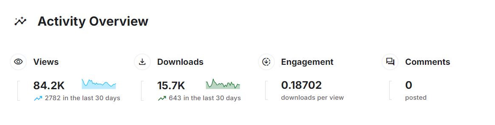

# Data Collection and Description 

 
## Description
This dataset provides comprehensive information on Amazon book reviews and book details, ideal for various analytical tasks. It includes:

1. Reviews File
The reviews file contains feedback from over 3 million users on 212,404 unique books. This dataset is a subset of the Amazon review dataset, which spans from May 1996 to July 2014 and includes 142.8 million reviews. The file contains the following attributes:

| Features  | Description  | 
| --- | --- |
| id  | The Id of Book |
|Title|Book Title| 
|Price|The price of Book |
|User_id|Id of the user who rates the book|
|profileName|Name of the user who rates the book|
|review/helpfulness|helpfulness rating of the review, e.g. 2/3|
|review/score|rating from 0 to 5 for the book|
|review/time|time of given  the review|
|review/summary|the summary of a text review|
|review/text|the full text of a review|
|  |  

2. The second file **Books Details** file contains details information about  212404 unique books it file is built by using 
[google books API](https://developers.google.com/books/docs/overview) to get details information about books it rated in the first file 
and this file contains   

| Features  | Description  | 
| --- | --- |
|Title|Book Title|
|Descripe |decription of book |
|authors|Neme of book authors|
|image|url for book cover|
|previewLink|link to access this book on google Books|
|publisher|Name of the publisheer|
|publishedDate|the date of publish|
|infoLink|link to get more information about the book on google books|
|categories|genres of books|
|ratingsCount|averaging rating for book|
|  |  

## Recommender Tasks on the Dataset
This dataset supports various analytical tasks and model implementations, including:

- Recommender System: Building systems to recommend books based on user preferences. 📚
- Sentiment Analysis: Analyzing the sentiment of book reviews. 😊😞
- Text Classification: Categorizing text reviews into predefined classes. 🏷️
- Text Clustering: Grouping similar text reviews into clusters. 🗂️
- GANs for Book Cover Generation: Using Generative Adversarial Networks to generate book covers. 🎨
- Data Analysis: Performing in-depth analysis to extract insights from the data. 📊
- Visualization: Creating visual representations of data trends and insights. 📈

## Provenance
This dataset is built from two primary sources:

1. Amazon Reviews Dataset

    - Source: [Amazon Reviews Dataset](https://jmcauley.ucsd.edu/data/amazon/)
    - Citation:  
        - He, R., & McAuley, J. (2016). Ups and downs: Modeling the visual evolution of fashion trends with one-class collaborative filtering. WWW.
        - McAuley, J., Targett, C., Shi, J., & van den Hengel, A. (2015). Image-based recommendations on styles and substitutes. SIGIR.
2. Google Books API

    - Source: [Google Books API](https://developers.google.com/books/docs/overview)

## Collection Methodology
The Books Details file is created using the [Google Books API](https://developers.google.com/books/docs/overview) to gather detailed information about the books rated in the reviews file. This API provides comprehensive book data, including descriptions, authors, publication details, and cover images.

## License
This dataset is released under the CC0: Public Domain license, meaning it is free to use for any purpose without attribution.

## Activity Overview
this Activity until day `22/08/2024` 

- Views
Total Views: 84.2K
- Downloads
Total Downloads: 15.7K
- Engagement
Downloads per View: 0.18702

## Accessing the Dataset
You can download the dataset directly from Kaggle: [Amazon Books Reviews Dataset](https://www.kaggle.com/datasets/mohamedbakhet/amazon-books-reviews).